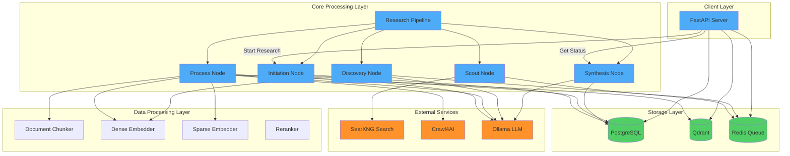
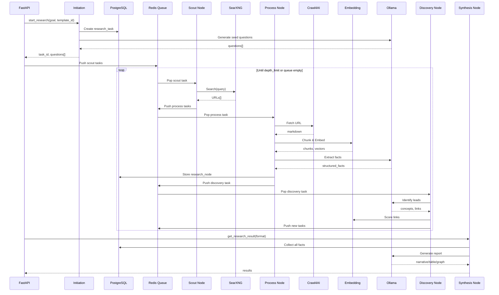
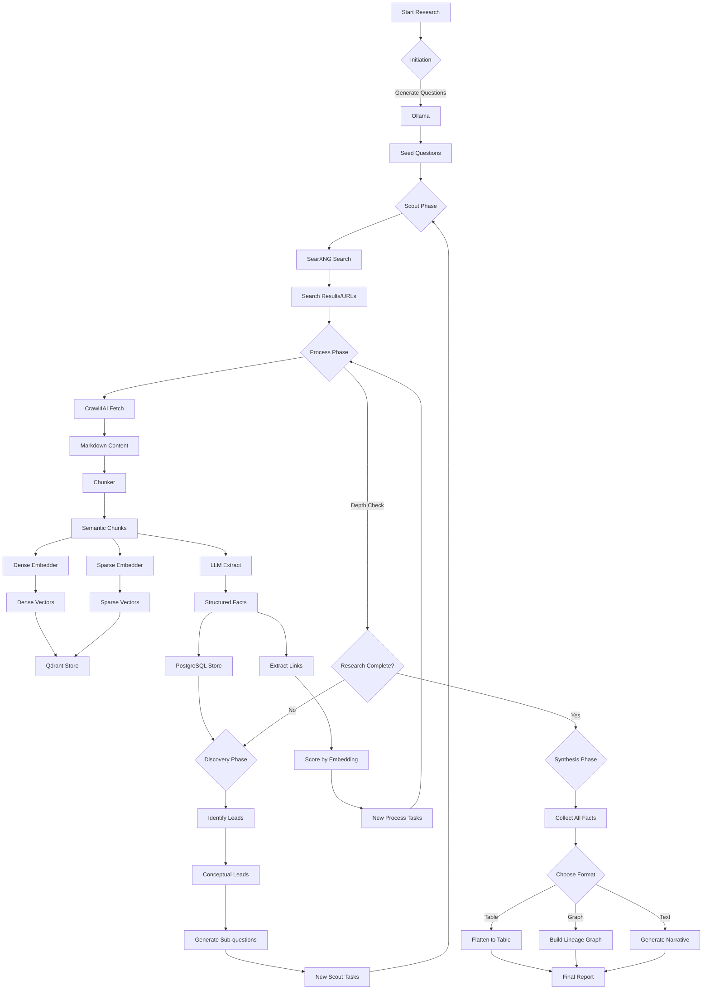

# AI Agents - Deep Research System

## Quick Start

```bash
# Start infrastructure (PostgreSQL, Redis, SearXNG)
make up

# Install dependencies
make i

# Run FastAPI server
make r

# Server runs on http://0.0.0.0:8000
# API docs: http://localhost:8000/docs
```

## High-Level Architecture

### System Architecture Diagram



### Research Pipeline Flow



### Data Flow Diagram



## Architecture Overview

### Core Components

#### 1. FastAPI Server (`internal/server/`)
- REST API endpoints for research management
- Lifespan management for initializing all services
- Health check endpoints
- Global state container (`ServerState`)

#### 2. Research Pipeline (`internal/research/`)
The research pipeline follows a 5-node architecture:

**Initiation Node** (`nodes/initiation.py`)
- Generates seed questions from research goal and template
- Uses LLM (Ollama) to create targeted research questions
- Creates initial research task in database

**Scout Node** (`nodes/scout.py`)
- Searches SearXNG for relevant URLs based on questions
- Returns ranked search results
- Queues process tasks for discovered URLs

**Process Node** (`nodes/process.py`)
- Crawls URLs using Crawl4AI
- Chunks markdown content into semantic chunks
- Generates dense and sparse embeddings
- Extracts structured facts using LLM
- Stores results in PostgreSQL and Qdrant

**Discovery Node** (`nodes/discovery.py`)
- Identifies leads from extracted facts
- Extracts and prioritizes links based on similarity
- Generates sub-questions for conceptual leads
- Recursively queues new research tasks

**Synthesis Node** (`nodes/synthesis.py`)
- Collects all facts from completed research nodes
- Generates reports in multiple formats:
  - **Table**: Flattened CSV/Markdown table
  - **Graph**: Mermaid.js lineage diagram
  - **Text**: Cohesive narrative report

#### 3. Chunking Pipeline (`internal/chunkers/`)

**Markdown Document Chunker** (`chunkers/markdown/`)
- Parses Markdown into AST using markdown-it-py
- Builds section hierarchy with parent-child relationships
- Applies element-specific chunking strategies:
  - `TableSplitter`: Splits tables by rows, preserves headers
  - `CodeSplitter`: Splits code blocks by logical units
  - `ListSplitter`: Splits lists by item groups
  - `TextSplitter`: Splits text by tokens/paragraphs
- Handles overlap between chunks
- Tracks section ancestry paths

#### 4. Embedding Layer (`internal/embedding/`)

**Dense Embedder** (`dense_embedder.py`)
- Uses SentenceTransformer (BAAI/bge-base-en-v1.5)
- Generates 768-dimensional dense vectors
- Supports GPU acceleration with FP16
- Token-aware truncation

**Sparse Embedder** (`sparse_embedder.py`)
- Uses SPLADE (prithivida/Splade_PP_en_v1)
- Generates high-dimensional sparse embeddings
- Optimized for lexical matching

**Reranker** (`reranker.py`)
- Uses CrossEncoder (BAAI/bge-reranker-v2-m3)
- Re-ranks search results by relevance

#### 5. Storage Layer (`internal/database/`)

**PostgreSQL** (`client.py`, `models.py`)
- Stores templates, research tasks, and research nodes
- Uses pgvector for similarity search
- Indexes on content_vector (HNSW), url, question_text
- JSONB columns for flexible schema (extracted_facts, schema_json)

**Qdrant** (`qdrant_client.py`)
- Hybrid vector store for dense + sparse embeddings
- HNSW indexing for fast dense vector search
- Sparse vector indexing for lexical matching
- RRF (Reciprocal Rank Fusion) for hybrid search

#### 6. Task Queue (`internal/queue/`)
- Redis-based priority queue
- Task types: "scout", "process", "discovery"
- Priority-based scheduling (0.0-1.0)
- Depth-limited recursion

#### 7. External Services
- **SearXNG**: Multi-engine web search
- **Crawl4AI**: Web scraping with markdown output
- **Ollama**: Local LLM for structured extraction (llama3.2)

### Chunking Pipeline Details
1. Parse Markdown into AST (markdown-it-py)
2. Build section hierarchy - group elements under parent headers
3. Apply element-specific chunking:
   - Tables: split by rows, preserve headers
   - Code blocks: split by logical units
   - Lists: split by item groups
   - Text: split by tokens/paragraphs

### Research Pipeline Nodes
- **Initiation**: Generate seed questions from goal + template
- **Scout**: Search SearXNG for relevant URLs
- **Process**: Crawl URL → chunk → embed → extract facts
- **Discovery**: Identify leads → score links → generate sub-questions
- **Synthesis**: Aggregate facts → generate reports (table/graph/text/PDF)

## API Endpoints

### POST `/research/start`
Start a new research task.

**Request:**
```json
{
  "goal": "Analyze the impact of AI on healthcare",
  "template_id": "template-uuid",
  "depth_limit": 3
}
```

**Response:**
```json
{
  "task_id": "task-uuid",
  "goal": "...",
  "template_id": "...",
  "depth_limit": 3,
  "seed_questions": ["...", "..."],
  "status": "pending"
}
```

### GET `/research/{task_id}`
Get research task status and progress statistics.

### GET `/research/{task_id}/result?format={table|graph|text}`
Get research results in specified format.

## Documentation

- **AGENTS.md** - Detailed code standards, conventions, and technical specifications
- **TODO.md** - Implementation roadmap and task checklist
