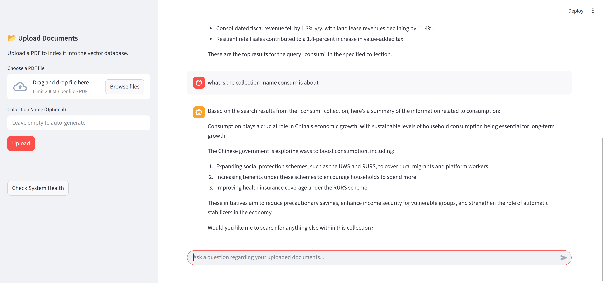

# AI Agents


From docs extraction to retrieval

## Running (Makefile)
- make up: start docker compose
- make r: run app server
- make c: run client

## Chunking Architecture
1. parsing markdown into AST (Abstract Syntax Tree) structure
2. build section hierarchy. Group all related elements under 1 Parent element. for example: header (#) is the bigger header so elements (##, ###, list, tables) that are under it will be grouped into 1
3. chunking the section where each elements have their own chunking strategy, for example: if tables to large split by rows while still keep the table header

## Embedding Architecture
1. use Qdrant for vector store (dense and sparse) vector

## Retrieval Architecture
1. generate 2 embed query for sparse and dense vector for hybrid search
2. use Reciprocal Rank Fusion (RRF) for hybrid search
3. rerank the result
4. compress the result using llm lingua (optional)

## AI Agents
1. create agents using PydanticAI
2. model: Ollama (configurable)

## Directory structure
```
.
├── internal/
│   │
│   ├── server/
│   │   ├── __init__.py
│   │   ├── server.py             # FastAPI app + agent initialization
│   │
│   ├── chunkers/                 # Document chunking system
│   │   ├── __init__.py
│   │   ├── base_chunker.py
│   │   ├── chunker_factory.py
│   │   └── markdown/             # Markdown-specific chunking
│   │       ├── markdown_chunker.py
│   │       ├── markdown_parser.py
│   │       ├── section_analyzer.py
│   │       ├── overlap_handler.py
│   │       ├── table_splitter.py
│   │       ├── code_splitter.py
│   │       ├── list_splitter.py
│   │       └── text_splitter.py
│   │
│   ├── embedding/                # Embedding & Ranking
│   │   ├── dense_embedder.py
│   │   ├── reranker.py
│   │   └── sparse_embedder.py
│   │
│   ├── processing/               # Result processing
│   │   ├── __init__.py
│   │   ├── document_extractor.py # PDF → Markdown
│   │   └── context_compressor.py # LLMLingua compression
│   │
│   ├── storage/                  # Vector database
│   │   └── qdrant_client.py
│   │
│   ├── text_processing/          # Text utilities
│   │   ├── sentence_splitter.py
│   │   └── tokenizer_utils.py
│   │ 
│   ├── utils/          
│   │   ├── sentence_splitter.py
│   │   └── token_counter.py
│   │
│   ├── config.py                 # Configuration management
│   ├── logger.py                 # Logging setup
│   └── schema.py                 # Data models
│
├── config.yaml                   # Main configuration
├── requirements.txt              # Python dependencies (includes pydantic-ai)
├── Makefile
├── docker-compose.yml
└── README.md
```
