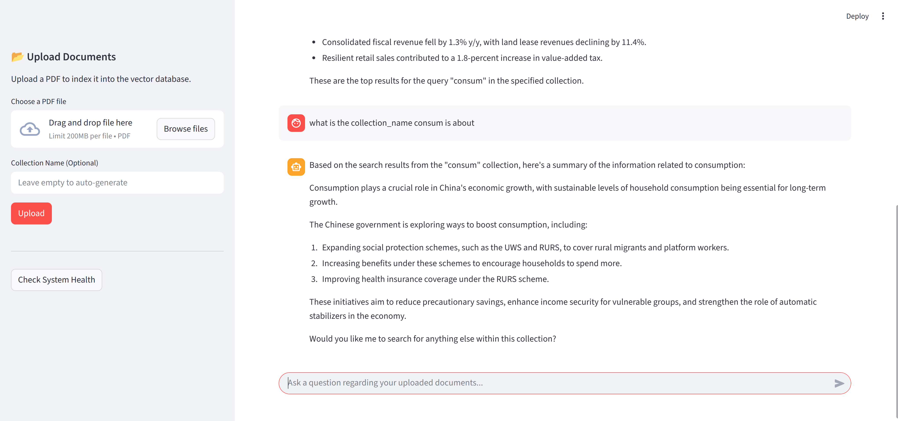

<<<<<<< HEAD
# Bwired

## Features

- **Document Processing**: Convert PDFs and other formats to Markdown using Docling
- **Intelligent Chunking**: Advanced Markdown-aware chunking with special handling for:
  - Tables, code blocks, and lists
  - Header-based sections
  - Token overlap between chunks
- **Hybrid Search**: Combine dense and sparse embeddings for better retrieval
- **Reranking**: Reorder search results using BAAI/bge-reranker-v2-m3
- **Context Compression**: Reduce retrieved context size with LLMLingua
- **Vector Storage**: Qdrant vector database for efficient similarity search
- **FastAPI**: RESTful API with CORS support

## Architecture
=======
# AI Agents


From docs extraction to retrieval

## Running (Makefile)
- make up: start docker compose
- make r: run app server
- make c: run client
>>>>>>> main

### Components

- **Chunker Factory**: Creates appropriate chunkers based on document format
- **Dense Embedder**: Generates dense vectors using BAAI/bge-base-en-v1.5
- **Sparse Embedder**: Generates sparse vectors using SPLADE
- **Reranker**: Reorders search results for better relevance
- **Qdrant Client**: Manages vector storage and retrieval
- **Document Processor**: Handles text splitting and sentence segmentation
- **Server**: FastAPI application with lifespan management

### Models

- Dense Embedding: BAAI/bge-base-en-v1.5 (768 dimensions)
- Sparse Embedding: prithivida/Splade_PP_en_v1
- Reranker: BAAI/bge-reranker-v2-m3
- Context Compression: microsoft/llmlingua-2-bert-base-multilingual-cased-meetingbank

## Development

### Project Structure

```
bwired/
├── internal/
│   ├── chunkers/          # Document chunking logic
│   │   ├── base_chunker.py
│   │   ├── chunker_factory.py
│   │   └── markdown/
│   │       ├── text_splitter.py
│   │       ├── table_splitter.py
│   │       └── list_splitter.py
│   ├── embedding/         # Dense and sparse embedders
│   │   ├── dense_embedder.py
│   │   └── sparse_embedder.py
│   ├── processing/        # Text processing and reranking
│   │   ├── sentence_splitter.py
│   │   ├── document_extractor.py
│   │   ├── reranker.py
│   │   └── context_compressor.py
│   ├── retriever/         # Search and retrieval
│   │   ├── retriever.py
│   │   └── metadata.py
│   ├── server/            # FastAPI application
│   │   ├── server.py
│   │   ├── chat_api.py
│   │   ├── search_api.py
│   │   └── upload_docs_api.py
│   └── storage/           # Qdrant client
│       └── qdrant_client.py
├── config.yaml            # Configuration file
├── requirements.txt       # Python dependencies
├── docker-compose.yml     # Qdrant service
└── Makefile              # Convenience commands
```
