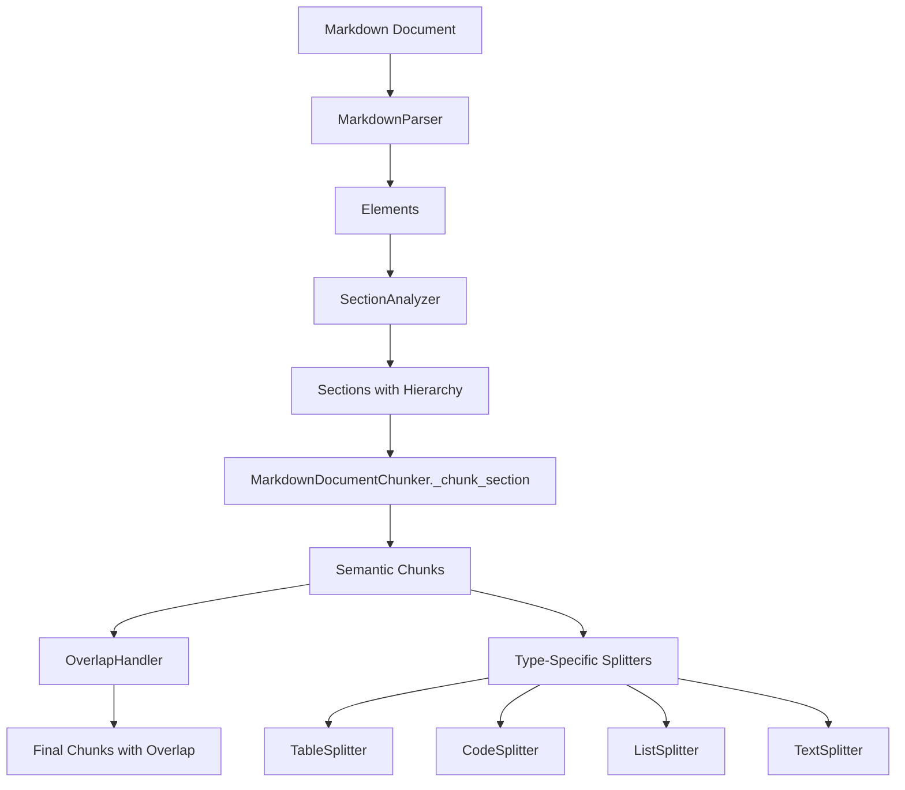

# Markdown Chunking Architecture

This module provides semantic document chunking for markdown files, optimized for RAG (Retrieval-Augmented Generation) workloads.

## Overview

The chunking pipeline follows a 4-stage process:

```
Stage 1: Parse → Stage 2: Analyze Sections → Stage 3: Chunk → Stage 4: Apply Overlap
```

## Architecture Diagram



## Module Structure

| File | Purpose |
|------|---------|
| [`markdown_chunker.py`](markdown_chunker.py) | Main orchestrator - 4-stage pipeline |
| [`markdown_parser.py`](markdown_parser.py) | Convert markdown text to elements |
| [`section_analyzer.py`](section_analyzer.py) | Build hierarchical section tree |
| [`text_splitter.py`](text_splitter.py) | Split paragraphs at sentence boundaries |
| [`table_splitter.py`](table_splitter.py) | Split tables preserving header |
| [`code_splitter.py`](code_splitter.py) | Split code blocks at line boundaries |
| [`list_splitter.py`](list_splitter.py) | Split lists at item boundaries |
| [`overlap_handler.py`](overlap_handler.py) | Apply sliding window overlap |
| [`utils.py`](utils.py) | Helper functions: `link_chunks`, `create_chunk` |

## Processing Stages

### Stage 1: Parse
[`MarkdownParser`](markdown_parser.py:32) converts raw markdown into structured elements:

- **HEADING**: `# Title` (levels 1-6)
- **PARAGRAPH**: Regular text blocks
- **CODE_BLOCK**: ```python ... ```
- **LIST**: `- item` or `1. item`
- **TABLE**: `| col | col |`
- **BLOCKQUOTE**: `> quote`
- **HORIZONTAL_RULE**: `---`

### Stage 2: Analyze Sections
[`SectionAnalyzer`](section_analyzer.py:20) builds a hierarchical tree:

```python
Section(
    heading="Introduction",
    level=1,
    content_elements=[...],
    subsections=[
        Section(heading="Background", level=2, ...),
        Section(heading="Methods", level=2, ...)
    ]
)
```

Skips content before first heading (e.g., title blocks).

### Stage 3: Chunk Sections
[`MarkdownDocumentChunker._chunk_section()`](markdown_chunker.py:93) processes each section:

1. **Buffer small elements** together until `max_chunk_size` is reached
2. **Handle special elements** (tables, code blocks) individually
3. **Recursively process subsections** with ancestry tracking
4. **Filter metadata noise** (references, bibliographies, TOCs)

**Chunk types**: `text`, `table`, `code_<language>`, `list`

**Metadata**:
- `parent_section`: Immediate parent heading
- `section_path`: Full ancestry (e.g., "Introduction > Background")
- `chunk_type`: Type of content

### Stage 4: Apply Overlap
[`OverlapHandler`](overlap_handler.py:13) adds sliding window overlap:

- Only applies within same section
- Skips tables (structure-sensitive)
- Uses sentence boundaries for natural overlap
- Respects `max_tokens` limit

## Key Design Patterns

### 1. Template Method
[`BaseDocumentChunker`](base_chunker.py:12) defines the interface; [`MarkdownDocumentChunker`](markdown_chunker.py:23) implements format-specific logic.

### 2. Strategy Pattern
Type-specific splitters implement the same interface:

```python
class TextSplitter:
    def chunk(self, element, header_path) -> List[SemanticChunk]: ...

class TableSplitter:
    def chunk(self, element, header_path) -> List[SemanticChunk]: ...
```

### 3. Bidirectional Linking
[`link_chunks()`](utils.py:8) assigns:
- `prev_chunk_id`: Link to previous chunk
- `next_chunk_id`: Link to next chunk  
- `split_sequence`: Position (e.g., "2/5")

### 4. Utility Functions
- [`create_chunk()`](utils.py:23): Standardized chunk creation with UUID
- [`link_chunks()`](utils.py:8): Assign sequential relationships

## Configuration

See `config.chunking`:
- `max_chunk_size`: Maximum tokens per chunk
- `overlap_tokens`: Tokens to overlap between chunks

## Usage Example

```python
from internal.chunkers import ChunkerFactory
from internal.config import load_config

config = load_config("config.yaml")
chunker = ChunkerFactory.create("markdown", config)

chunks = chunker.chunk_document(markdown_content, document_id="doc-1")

for chunk in chunks:
    print(f"{chunk.chunk_type}: {chunk.content[:50]}...")
    print(f"  Section: {chunk.section_path}")
    print(f"  Linked: {chunk.prev_chunk_id} <-> {chunk.id} <-> {chunk.next_chunk_id}")
```

## Output Schema

Each chunk is a [`SemanticChunk`](schema.py:5):

```python
@dataclass
class SemanticChunk:
    id: str                          # Unique UUID
    content: str                     # Chunk text
    token_count: int                 # Token count
    chunk_type: str                  # Type: text, table, code_*, list
    parent_section: str              # Immediate parent heading
    section_path: str                # Full ancestry path
    split_sequence: Optional[str]    # e.g., "1/5"
    next_chunk_id: Optional[str]     # Forward link
    prev_chunk_id: Optional[str]     # Backward link
```

## Extending the Module

### Adding a New Splitter

1. Create `new_splitter.py`:

```python
class NewSplitter:
    def __init__(self, config, sentence_splitter, token_counter):
        ...
    
    def chunk(self, element, header_path) -> List[SemanticChunk]:
        ...
```

2. Import in [`markdown_chunker.py`](markdown_chunker.py:7-18):

```python
from .new_splitter import NewSplitter
```

3. Initialize in `__init__`:

```python
self.new_splitter = NewSplitter(config, sentence_splitter, token_counter)
```

4. Use in `_chunk_element()`:

```python
elif element.type == ElementType.NEW_TYPE:
    chunks = self.new_splitter.chunk(element, header_path)
```

### Adding a New Element Type

1. Add to [`ElementType`](markdown_parser.py:11) enum
2. Add parser logic in [`MarkdownParser`](markdown_parser.py:32)
3. Add splitter if needed
4. Handle in [`MarkdownDocumentChunker._chunk_element()`](markdown_chunker.py:166)
